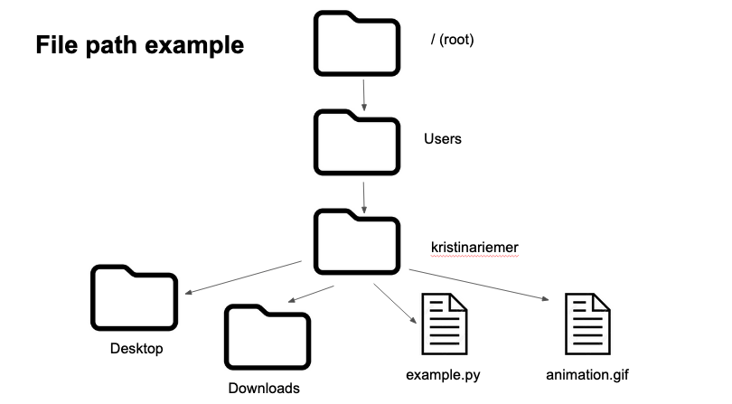
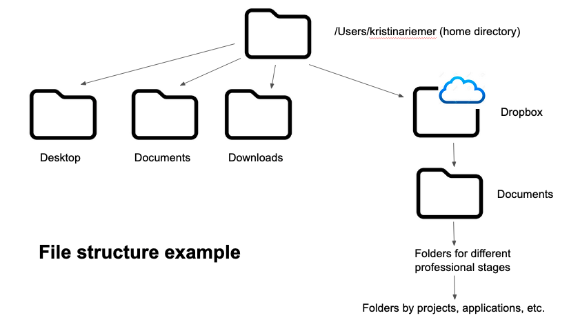
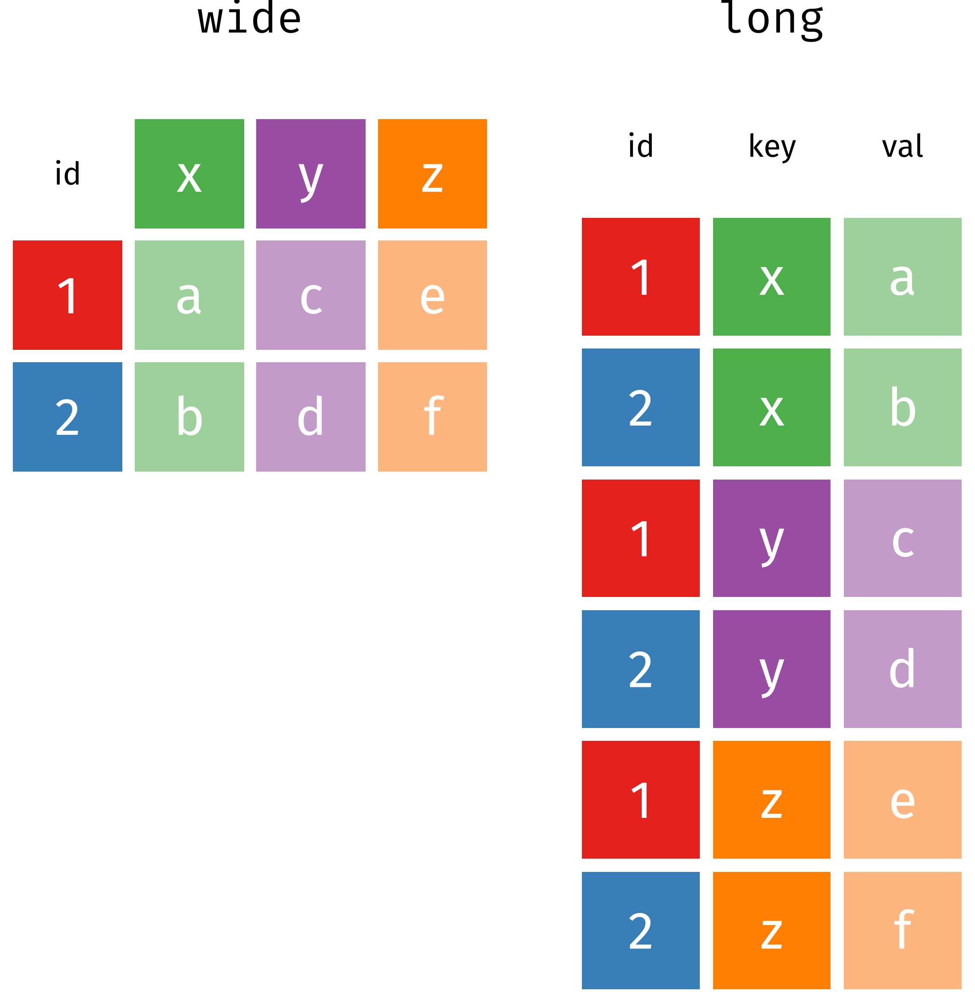

*Note: The primary purpose of this curriculum page is to help instructors teach the material. Tangential purposes include sharing content with potential workshop participants and other educators. While this page can be used by workshop participants to review materials or for self-guided learning, it is not optimally designed for those purposes.*

## Workshop Overview

### Purpose

To introduce CALS researchers to better practices for sharing their code and results, managing their projects, and improving reproducibility of their computational work. Learners who already use R and RStudio will get the most out of this workshop. 

### Instructional objectives

1. **Share & collaborate** 
    - Learn how to do version control for code and data files
    - *Tools*: shell, git & GitHub via the RStudio terminal pane

2. **Manage & organize**
    - Learn how to organize projects and use coding better practices
    - *Tools*: RStudio projects

3. **Repeat & reproduce**
    - Learn to repeat coding tasks more effectively and refactor code to be more reusable and reproducible
    - *Tools*: base R
    
4. **Clean & plot**
    - Learn to use tidyverse tools to modify and visualize data
    - *Tools*: dplyr/tidyr/ggplot2

3. **Document & publish**
    - Learn how to write project READMEs and publicly publish reports
    - *Tools*: markdown, Rmarkdown files, RPubs, RStudio Connect, GitHub

### General structure
This workshop was originally taught as a series of 8 two-hour virtual sessions, meeting twice a week for four weeks. We have now added two sessions, such that the workshop series can extend fro 8, 9, or 10 sessions.  

Lesson 4 is an optional extension to explore the foundations of collaborating on GitHub, including forking, remotes, and pull requests. Lessons 6 thru 9 are now modular, meaning that they are independent of each other and can be mixed and matched depending on learner interest. 

Relatively small workshop size (< 15) helped keep one-on-one troubleshooting manageable for two instructors. 

The workshop format is primarily code-along, with some sessions that include slides, discussion, and demonstration. We use R/RStudio for the entire workshop. Students should install [R](https://cran.r-project.org/) and [RStudio](https://www.rstudio.com/products/rstudio/download/#download) prior to the first class. 

## Lessons 

### Table of contents

| Lesson  | Theme | Topic   |
|---|---|---|
| 1  | Share & collaborate | [Shell scripting](#lesson-1)  |
| 2 | Share & collaborate | [Version control with git](#lesson-2) | 
| 3  | Share & collaborate | [Developing code on GitHub](#lesson-3)  |
| 4 (optional) | Share & collaborate | [Collaborating with GitHub](#lesson-4)  |
| 5  | Manage & organize | [Project management and coding best practices](#lesson-5) |
| 6 (modular) | Repeat & reproduce  | [Intermediate R programming I](#lesson-6)  |
| 7 (modular) | Repeat & reproduce | [Intermediate R programming II](#lesson-7)  |
| 8 (modular) | Clean & plot | [Data manipulation](#lesson-8)  |
| 9 (modular) | Clean & plot | [Data visualization](#lesson-9) |
| 10 | Document & publish | [Documentation](#lesson-10)  |

### Lesson subheader definitions

**"Installation & materials"** lists what needs to be installed for the lesson and provides links to all lesson materials used, which were mostly sourced from [The Carpentries'](https://carpentries.org/) excellent content. 

**"Review"** suggests warm up activities to begin each session. 

**"Modifications"** details how we changed the lesson materials so that lessons worked together and fit the two hour lesson time limit. Includes what we left out, when order was changed, and when we did something different. 

**"Teaching notes"** provides information and tips about how we taught the material, including troubleshooting installation instructions. 

**"Homework"** adds optional exercises and tasks to reinforce lesson content and/or prepare for the next lesson.

---

### Lesson 1

#### Topic
Shell scripting

#### Objective
Learners should be comfortable with their file structure and navigating around it using command line commands in RStudio Terminal pane. 

#### Installation & materials

1. [MacOS git installation](https://sourceforge.net/projects/git-osx-installer/files/)
2. [Windows git installation](https://git-scm.com/download/win)
3. [Software Carpentry Unix Shell episode #1 ](https://swcarpentry.github.io/shell-novice/01-intro/index.html) 
4. [Software Carpentry Unix Shell episode #2](https://swcarpentry.github.io/shell-novice/02-filedir/index.html) 

##### Modifications
 - Use terminal window within RStudio as command line interface
     - Start with a brief overview of RStudio panes
     - Only need to use Terminal and Files tabs
     - Emphasize that Files tab is analogous to file finder
 - Skip all exercises, including "Nelle" example
 - At beginning of episode #2, explain file path using example from instructor's file system; example diagram below
 


 - Can also use example diagram for file system using instructor's


#### Teaching notes
- If not already installed, learners should install R and RStudio
- Need to install git initially for Windows users to have shell commands
     - Separate into 2 breakout rooms to install git/GitBash for Windows and Macs
     - Restart RStudio after installation
     - For Windows, open RStudio Tools/Global Options/Terminal and make sure GitBash is selected
- Download shell-lesson-data.zip into temporary location, this won't be referenced in later lessons
- Emphasize purposes for learning shell
     - Helpful for using git and GitHub
     - Easier to deal with installation problems
     - Understanding file structure and file paths
- Unzipping shell-lesson-data.zip through point-and-click in the RStudio Files tab does not work consistently across machines; may have to suggest unzipping through file explorer or with R command `unzip`
  - Once unzipped, have everyone share absolute file path to location of file
- If there's additional time, can also cover [Software Carpentry Unix Shell episode #3](https://swcarpentry.github.io/shell-novice/03-create/index.html) 

#### Homework
Create diagram, with pen and paper or digitally, of their own file system. 

---

### Lesson 2

#### Topic
Version control with git

#### Objective
Learners will practice how changes to code are tracked with version control and become familiar with command-line git within the RStudio IDE. 

#### Installation & materials

1. [Software Carpentry Version Control with Git episode #2](https://swcarpentry.github.io/git-novice/02-setup/index.html)
2. [Software Carpentry Version Control with Git episode #3](https://swcarpentry.github.io/git-novice/03-create/index.html)
3. [Software Carpentry Version Control with Git episode #4](https://swcarpentry.github.io/git-novice/04-changes/index.html)
4. [Software Carpentry Version Control with Git episode #5](https://swcarpentry.github.io/git-novice/05-history/index.html)

##### Review
Ask students to share their diagram of their file system. Warm up by navigating to the Documents folder. 

##### Modifications
 - Use `mkdir` to make a new folder and name it pilot-analyses
 - Use RStudio interface to create a new/blank R file (rather than using the planets example)
 - Add R pseudocode or comments to blank R file

#### Teaching notes
 - When setting up git for the first time, remind students to use the same email as their existing GitHub account or to select an email that will be used for GitHub
 - Reinforce using `cd` and `ls -al` to move around the file structure and see contents
 - Show how git restore can be used to undo a saved file
 - HEAD is the snapshot of your last commit
 - Can use git reset HEAD~ to undo the last commit and unstage everything - the equivalent of reversing the git add and git commit commands. 

#### Homework
Create a GitHub account if you don't already have one. For an extra challenge, identify an existing folder and turn into a repository. 

---

### Lesson 3

#### Topic
Developing code on GitHub

#### Objective
Learners will share their local repository on GitHub and learn how to sync some files while ignoring others systematically. Learners will practice developing new code on branches. 

#### Installation & materials

1. [Software Carpentry Version Control with Git episode #6](https://swcarpentry.github.io/git-novice/06-ignore/index.html)
2. [Software Carpentry Version Control with Git episode #7](https://swcarpentry.github.io/git-novice/07-github/index.html)
3. [Software Carpentry branching add-on](http://erdavenport.github.io/git-lessons/10-branching.html)

##### Review
If anyone turned a folder into a repository, share how that went. Ask students to navigate to previous repository, add new R file, and practice an add-commit cycle. 

##### Modifications
 - Provide a large .csv file, ask students to move into pilot-analyses repo within a data folder using cd and filepaths
 - Use RStudio interface to create a new text file, save as .gitignore; explore how to suppress a specific file, files within a folder, and specific kinds of file extensions
 - Start #7 with SSH setup. `ssh-keygen -t ed25519 -C "username@laptop"` will create a .ssh file if one does not already exist
 - Proceed to connecting local repository to GitHub repository
 - Show how checking out a branch literally changes the local files
 
#### Teaching notes
 - Practice another add-commit cycle after creating the .gitignore 
 - If `ssh -T git@github.com` doesn't work, could be an issue with OpenSSH. Try a different ssh flavor:
     - `which -a ssh`
     - Use a non OpenSSH version, e.g., `/usr/bin/ssh -T git@github.com`
 - Introduce the add-commit-push cycle

#### Homework
If Lesson 4 will not be taught, skim [tidyverse R style guide](https://style.tidyverse.org/index.html). What practice or guideline was new to you?

Otherwise, connect personal repository to GitHub. 

---


### Lesson 4

#### Topic
Collaborating with GitHub

#### Objective
Learners will fork and clone a repository on GitHub and use branches to open pull requests. 

#### Installation & materials

1. Workshop [repository](https://github.com/az-digitalag/data-sci-workshop)
2. [Software Carpentry Version Control with Git episode #8](https://swcarpentry.github.io/git-novice/08-collab/index.html)

##### Review
If anyone connected a local repository to GitHub, share how that went. Ask students to navigate to previous repository, amend an existing file, and practice an add-commit-push cycle. 

##### Modifications
 - The only part of #8 that was taught was cloning a forked repository. Ask students to fork an instructor-created repository, then clone locally. This will be the repo for downstream files. 
 - Use `git remote add upstream xxxx` to connect repo to upstream. If time permits, demonstrate a pull request (PR).
 - Share [diagram](https://www.tomasbeuzen.com/post/git-fork-branch-pull/) of relationships between the remotes (upstream and origin) and local
 - Demonstrate pull requests on GitHub
 - Show how distinct units of work can be separately submitted via branches

#### Teaching notes
 - Create a repo for them to fork that contains more realistic codebase, e.g., R package
 - Easy to check on learner progress by looking for who has and hasn't forked repo

#### Homework
Skim [tidyverse R style guide](https://style.tidyverse.org/index.html). What practice or guideline was new to you?

---

### Lesson 5

#### Topic
Project management and coding best practices

#### Objective
Learners will learn about and practice managing their projects using file structure and RStudio projects, and about current best practices and style guides for R coding. (optional) They will also get more comfortable with version control through learning and doing pull requests and reinforcement of git cycle.

#### Installation & materials

1. [Software Carpentry Introduction to R and RStudio episode](https://swcarpentry.github.io/r-novice-gapminder/01-rstudio-intro/index.html)
2. [Software Carpentry Project Management with RStudio episode](https://swcarpentry.github.io/r-novice-gapminder/02-project-intro/index.html)
3. [Software Carpentry Best Practices for Writing R Code](http://swcarpentry.github.io/r-novice-inflammation/06-best-practices-R/index.html)

##### Review
If lesson 4 was covered, do exercise asking participants to identify who owns the following repos and where they are located, for upstream, origin, and local repos. See example diagram below: 


If lesson 4 was not covered, do the review section in lesson 4. 

##### Modifications
- RStudio
    - Cover only "Introduction to RStudio" section unless learners need a refresher on R
    - Additional keyboard shortcuts from [RStudio's reference list](https://support.rstudio.com/hc/en-us/articles/200711853-Keyboard-Shortcuts)
- Project management
    - Do "Best practices for project organization" including yellow "Tip: Good Enough Practices for Scientific Computing" box
    - Then "A possible solution" section about R projects
    - Include splitting scripts up into modular chunks to promote reproducibility and avoiding rerunning time-intensive data cleaning; use sapflow as example
- Coding best practices
    - Condensed into a [single slide](https://docs.google.com/presentation/d/1WNNHQtzq2IUMA0RPz9pwgDCTMLzMIxqQhQsTuR0m_BY/edit#slide=id.geda00d7b2c_0_0)

#### Teaching notes
- After introducing concept of R projects, walk through turning their local copy of forked repo into an R project
- To practice git, add new `*.Rproj` to `.gitignore`, then commit and push to remote repo
- Include how R projects promotes reproducibility, by being able to save scripts and close them or entire project
- Discuss what new concepts learners discovered in tidyverse style guide
- Can start homework during session
- If lesson 4 was skipped, add, commit, push these changes and then walk through [opening a pull request](https://docs.github.com/en/github/collaborating-with-pull-requests/proposing-changes-to-your-work-with-pull-requests/creating-a-pull-request-from-a-fork) to the upstream (instructor's) repo
    - This is another nice way to keep track of learners' progress

#### Homework
Revise the plot_ts.R script to adhere to style guide and best practices. Optionally, can clean up their own R pre-existing R script using best practices, or redo file organization for an existing research project. 

---

### Lesson 6

#### Topic
Intermediate R programming I

#### Objective
Learners will learn how to make their R code more reproducible using functions and control flow approaches. 

#### Installation & materials

1. [Data Carpentry for Biologists functions lecture](https://datacarpentry.org/semester-biology/materials/functions-R/)
2. [Data Carpentry for Biologists conditionals lecture](https://datacarpentry.org/semester-biology/materials/conditionals-R/)

##### Review
Ask to share cleaning up of example script, their own script, or their research project folder from lesson 5. To review the first 4-5 sessions, we can play the [jeopardy-style game](https://jeopardylabs.com/play/data-science-workshop-review-sessions-1-4) in a non-competitive fashion. 

##### Modifications
- For functions lecture, had them do only the "Use and Modify" exercise
- From conditionals lecture, only did "if statements" section
- From latter, only did "Basic If Statements" #2 exercise
- Added on brief explanation of `ifelse`, using the example of `ifelse(length == 5, "correct", "incorrect")`

#### Teaching notes
- Create new R script for functions content, and another new R script for control flow (ifelse and for loops) content
- Include real world examples of if and ifelse statements to motivate their use, especially for checking if files already exist
- Demonstrate git add, commit, and push files or file changes at the end of each set of material

#### Homework
Create a plan for applying these skills to their own research projects. Can apply different parts to different projects, or more integratively to one single project. Some possibilities: 

- Turn the project folder for one of your current research project into a git/GitHub repo and/or R project
- Modify an R script to use functions, if/for loops, or format code according to best practices
- Improve file and folder organization for project or your entire computer! 

---

### Lesson 7

#### Topic
Intermediate R programming II

#### Objective
Learners will learn how to make their R code more reproducible using for loops and the apply family of functions.  

#### Installation & materials

1. [Data Carpentry for Biologists for loop lecture](https://datacarpentry.org/semester-biology/materials/for-loops-R/)
2. [Data Carpentry for Biologists iteration without loops lecture](https://datacarpentry.org/semester-biology/materials/iteration-without-loops-R/)? 

#### Review
Can share their plans for apply skills to their research

##### Modifications
- What order to teach these in?
- For for loops lecture:
    - At "Do Tasks 3-4...", do "Basic For Loop" exercises #2 & #3
    - Skip sections "Looping over multiple values" and "Looping with functions"
    - If sufficient time, do "Storing loop results in a data frame", otherwise stop there

#### Teaching notes
 - Create new R script for these materials
 - Refine teaching indexing vs. non-indexing for loop methods, including when to use each
 - Unzipping locations.zip with R command `unzip` can cause errors; may need to manually unzip files or redownload files with download.file argument mode set to "wb"
 - Currently getting warnings from "Looping over files section" but wasn't able to troubleshoot, so used as a teaching opportunity to discuss warnings vs. errors

#### Homework
None

---

### Lesson 8

#### Topic
Data manipulation

#### Objective

Learn how to reproducibly clean, summarize, and reorganize dataframes using tidyverse R packages. 

#### Installation & materials

1. Install R packages 'dplyr', 'tidyr', 'readr' and 'udunits2'
2. [Data carpentry R ecology episode #3](https://datacarpentry.org/R-ecology-lesson/03-dplyr.html)

##### Modifications
 - Introduced `readr::read_csv()` in lieu of `read.csv()`, which reads character strings as characters (not factors) and imports time/date columns
 - Introduced `ud.convert()` as a less error-prone way of performing conversions, compatible within `mutate()`
 - Show below diagram to illustrate wide versus long data, and why experimental units will differ based on the question asked



 - Updated to the more modern `tidyr::pivot_longer()` and `tidyr::pivot_wider()`
     - `surveys_gw <- surveys %>% filter(!is.na(weight)) %>% group_by(plot_id, genus) %>% summarize(mean_weight = mean(weight))`
     - `surveys_wide <- surveys_gw %>% pivot_wider(names_from(genus), values_from = mean_weight)`
     - `surveys_long <- surveys_wide %>%
  pivot_longer(-plot_id, names_to = "genus", values_to = "mean_weight")`

 - Used `readr::write_csv()`, which eliminates need for `row.names = FALSE`
 - Ended with saving script and doing an add-commit-push cycle to sync local repository with GitHub repository

#### Teaching notes
 - Have students install each library separately rather than as the tidyverse - can be important to know which functions come from which packages
 - Encourage use of `ud.convert()` to avoid unit conversion errors
 
#### Homework
None

---

### Lesson 9

#### Topic
Data visualization

#### Objective
Learners will learn how to build figures using ggplot and practice making multiple plots (for loops, faceting) . 

#### Installation & materials
1. Install 'ggplot2'
2. [Data Carpentry R ecology lesson](https://datacarpentry.org/R-ecology-lesson/04-visualization-ggplot2.html) - #4 'Data visualization'

##### Modifications
 - Make a time series plot, but with mean weights across a particular species (`species_id == "DM"`)
     - Reinforce the `group_by()` and `summarize()` functions from an earlier lesson
     - Demonstrate piping datasets into `ggplot()`
 - Challenge students to filter by and plot all members of the genus *Dipodomys*; what are some choices for differentiating between species?
     - Students may have used `color = species_id` within `aes()`
     - Show `facet_wrap()` as an option, particularly with `scales = 'free_y'`
 - Additional challenge of adding a third factor of sex (in addition to year and species_id)
     - Show `facet_grid()` as an option, with species by row and sex by column
     - What are the advantages and disadvantages of plotting together versus separately?
 - Final note of caution: it can be important to depict the number of samples that when into the sample mean and sd
     - Can be added with `geom_text()` to the graph itself
     - Or as a color axis when combined with `facet_grid()`

#### Teaching notes
 - Students may be familiar with the basics of ggplot already, this portion of the lesson emphasizes how to build plots and customize viewing options to maximize students' own understanding of their data (as opposed to how to make publication-quality graphs)
 - If 'Intermediate R programming II' was taught, challenge students to create plots of mass over time for each species within a genus using a for loop. Saving out plots with different names will be an extra challenge and require `paste0()`. 

#### Homework
None

---

### Lesson 10

#### Topic
Documentation

#### Objective
Learners will understand the purpose of a README and practice using Rmarkdown to document and publish reports.  

#### Installation & materials
1. Install R packages `rmarkdown` and `knitr`
2. [Data Carpentry for Biologists knitr lecture](https://datacarpentry.org/semester-biology/materials/knitr/)

##### Modifications
- No lesson materials for first section about READMEs
- For Rmarkdown lesson: 
    - Simplify text used to spend less time typing
    - Save .Rmd file in newly created `docs` folder (to demonstrate project management)
    - Skip "Citations" section
    - Stop at "R Presentations" section

#### Teaching notes
- Define README
    - Comes from software engineering
    - File that introduces and explains a project
    - Contains info about other files and folders in a repo
    - Also package versions and installation instructions, how to contribute
    - Should go in main folder of project
    - Usually a plain text file
    - Name is in all upper case
- Show an example of a README
- GitHub encourages use of README
    - Automatically asks to include one when creating new repo
    - Automatically displays one on repo main page if there is one
- Either have them create a new README from scratch, or we included one in the repo they forked so we had them open up the README in RStudio to edit later
- Explanation of markdown
    - What we can use to format README files and other plain text files
    - History
        - https://en.wikipedia.org/wiki/Markdown
        - https://daringfireball.net/projects/markdown/
    - Plain text formatting, can be converted to HTML
    - Compare file in RStudio to GitHub render
    - GUI vs. command line type approach
        - Can do same things in Word/Google Doc but is more explicit and less point and click
        - Also better for version control
    - Simple and easy to read and format
    - GitHub markdown specifically: https://guides.github.com/features/mastering-markdown/
- Walk through use of GitHub issues, including markdown check box list
    - Forked repos don't have issues included by default, change in repo settings
- Practice markdown and README concepts by adding a "Project files" section to their forked local repo README, which can look similar to the example below: 

```
 ### Project files
 
 - `data_raw` folder
   - `portal_data_joined.csv`: example data from [Portal project](https://portal.weecology.org/)
 - `scripts` folder
   - `01-data-manipulation.R`: introduction to dplyr
 - `plots` folder
```

- Switch to introducing Rmarkdown
    - Purpose is to share results as report, and possibly turn into manuscripts
    - Combines markdown-formatted text with code
- Do DC Rmarkdown lesson
- Add, commit, and push .Rmd file
- Demonstrate publishing Rmarkdowns on RPubs and RStudio Connect
    - Show an example
    - In RStudio, click blue publish button and select RPubs option
- Walk through using GitHub project boards and wiki for project management

#### Homework
None

## Technical notes
 - One early problem occurred when students were unsure of which 'Documents' or 'Desktop' folder they were saving to, which made navigating filepaths tricky. Note that on some PCs, the Windows OneDrive backup folders are saved to by default, but students should navigate to `C:/Users/username/Documents` or `C:/Users/username/Desktop`
- R packages sometimes did not install properly. 
    - One reason was that some usernames included special characters, which were not interpreted correctly. 
    - Another included R being installed on a remote server, rather directly on the local machine

## Acknowlegements

Thanks to Teresa Mourad and Fred Abbott of the Ecological Society of America, who invited us to teach the first half of the [Critical Skills to Scale Up Ecology workshop](https://www.esa.org/seeds/meetings/2021-gradstudent-critical-skills-workshop/), which planted the seed for developing this curriculum. We also appreciate the [inaugural class](https://datascience.cals.arizona.edu/spring-2022-workshop-series-reproducibility-and-data-science-skills) of this workshop series at UA in Spring 2022, who inspired deeper conversation about why and how to teach this course. Finally, a huge thanks to [The Carpentries organization](https://carpentries.org/) for generating all of the volunteer-created content we used here, and for training both of us in pedagogy. 
