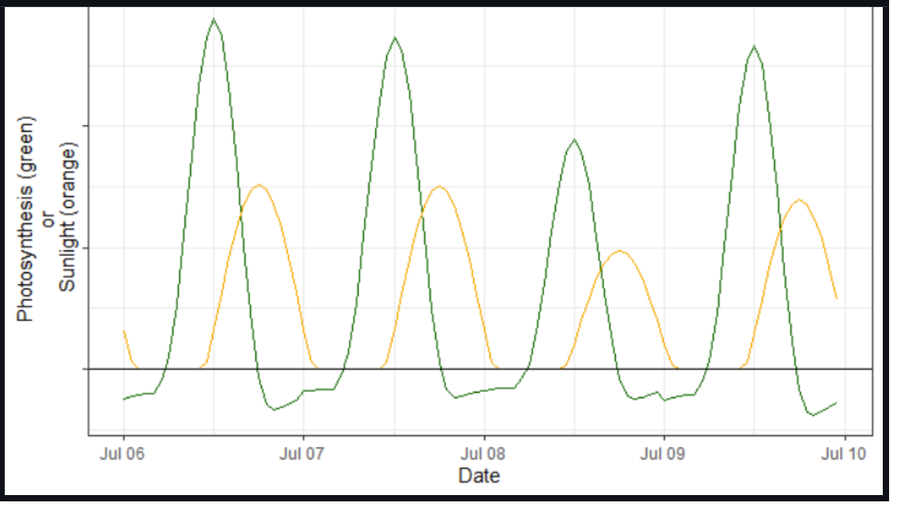

Dates and times in R
================

## Overview

#### Objectives

Learners will how dates and times are represented in base R and be able
to convert or import different formats, set time zones unambiguously,
and perform simple calculations. Then, learners will use the ‘lubridate’
package to extract date/time components and change time zones.

#### Schedule

| Topic                                                 | Start time |
|-------------------------------------------------------|------------|
| Introductions                                         | 11:00      |
| 1\. Date representation in base R                     | 11:05      |
| 2\. Date/time representation with POSIX               | 11:25      |
| 3\. Time zones and Olson names                        | 11:50      |
| 4\. Calculating time differences                      | 12:10      |
| 5\. Reading in dates and times                        | 12:15      |
| 6\. Extract time and date components with ‘lubridate’ | 12:30      |
| 7\. Changing time zones with ‘lubridate’              | 12:35      |
| Open problem solving                                  | 12:45      |

## Curriculum & Notes

### Introduction

Understanding how dates and times are represented in R is critical for
visualizing and analyzing time series data. We begin with the
sometimes-challenging task of converting character strings into date and
date/time objects. Common pitfalls can be avoided by utilizing
unambiguous formats and specifying time zones; time zones default to
`Sys.time()` unless specified, which presents a hazard to reproducible
analyses. Finally, we switch from base R to the ‘lubridate’ package to
accomplish two specific tasks: (i) extracting date/time components and
(ii) changing time zones, differentiating between converting between
time zones and correcting the underlying time value.

#### 1. Date representation in base R

<i>Content based on [Berkeley Stats curriculum
page](https://www.stat.berkeley.edu/~s133/dates.html)</i>

-   the base `as.Date()` function handles dates without times
-   Date objects are stored as the number of days since January 1, 1970,
    which can be retrieved with `as.numeric()`
-   accepts character strings and POSIXlt or POSIXct objects
-   to convert from a character string, the default format follows the
    [ISO 8601](https://en.wikipedia.org/wiki/ISO_8601) international
    standard, which is “YYYY-MM-DD”


-   if character string is <i>not</i> already in default format, the
    `format` argument should be specified to avoid ambiguity
-   there is an optional time zone or `tz` argument - more on this later

| Type  | Code | Value                   |
|-------|------|-------------------------|
| Day   | %j   | Day of year (1-366)     |
| Day   | %d   | Day of the month (1-31) |
| Month | %m   | Month (01-12)           |
| Month | %b   | Month (abbreviated)     |
| Month | %B   | Month (full name)       |
| Year  | %y   | Year (2 digit)          |
| Year  | %Y   | Year (4 digit)          |

Helpful hint: If you can’t recall the appropriate code, type `?strptime`
into your R console and scroll down.

Let’s explore the following:

``` r
x <- as.Date("2021-02-23")
x
class(x)

y <- as.Date("April 2, 2019", format = "%B %d, %Y")
y

#Try converting the following: 
"Sep 02 1995"
"19920613"
"12-Mar-12"
"2019 156"
```

#### 2. Date/time representation in POSIX

<i>Content based on [Berkeley Stats curriculum
page](https://www.stat.berkeley.edu/~s133/dates.html)</i>

-   POSIX stands for ‘<b>P</b>ortable <b>O</b>perating <b>S</b>ystem
    <b>I</b>nterface’, primarily for UNI<b>X</b>
-   POSIXlt stores a list of elements for second, minute, hour, day,
    month, and year
-   POSIXct stores date/time as number of seconds since January 1, 1970
    -   POSIXct is the standard choice for dates and times in R
    -   POSIX can also be used to store dates, or date/times without
        seconds
-   to convert character string to POSIXct, use `as.POSIXct()`
    -   default ISO 8601 standard is “YYYY-MM-DD hh:mm:ss”
    -   if character string is <i>not</i> already in default format, the
        `format` argument should be specified to avoid ambiguity
    -   if time zone is not specified with the `tz` argument,
        `as.POSIXct()` will default to your `Sys.time()` time zone
-   to convert components of date/time into POSIXct, use `ISOdate()` or
    `ISOdatetime()`
    -   specify numeric value of year, month, day, hour, min, sec
    -   if time zone is not specified, `ISOdate()` will default to GMT
    -   if time zone is not specified, `ISOdatetime()` will default to
        your `Sys.time()` time zone

| Type   | Code | Value                   |
|--------|------|-------------------------|
| Hour   | %H   | Hour (0-24)             |
| Minute | %M   | Minute (0-59)           |
| Second | %S   | Second (0-59)           |
| Day    | %j   | Day of year (1-366)     |
| Day    | %d   | Day of the month (1-31) |
| Month  | %m   | Month (01-12)           |
| Month  | %b   | Month(abbreviated)      |
| Month  | %B   | Month(full name)        |
| Year   | %y   | Year (2 digit)          |
| Year   | %Y   | Year (4 digit)          |

Let’s explore the following:

``` r
x <- as.POSIXct("2021-02-23 20:30:00")
x
class(x)
str(x)
attr(x, "tz")

y <- as.POSIXct("April 2, 2019 15:35", format = "%B %d, %Y %H:%M",
                tz = "America/Denver")
y
attr(y, "tz")

z <- ISOdatetime(year = 2021, month = 2, day = 23, hour = 20, min = 30, sec = 0,
                 tz = "America/Phoenix")
z

# Try converting the following: 
"06:59 Sep 02 1995"
"16/Oct/2005:07:51:00"
"12-Mar-2012 0830"
2013; 8; 18
```

#### 3. Time zones and Olson names

-   both `as.Date()` and `as.POSIXct()` have an optional `tz` argument
-   there exists a [tz
    database](https://en.wikipedia.org/wiki/Tz_database) that compiles
    information about all of the world’s time zones
-   the tz database name for a time zone is sometimes referred to as the
    Olson name
    -   Check `OlsonNames()` for complete list
-   each name includes the offset from UTC ([Coordinated Universal
    Time](https://en.wikipedia.org/wiki/Coordinated_Universal_Time)),
    including for Daylight Saving where observed
-   name is in format of Area/Location, e.g., America/Phoenix, where
    Area is typically the continent or ocean and Location is typically
    the most populous city or small island
-   for most of the United States that observes Daylight Saving,
    e.g. America/Los\_Angeles, the Olson name automatically switches
    between PST and PDT
-   time zone designation affects which date is assigned when converting
    between POSIX and Date formats

Let’s explore the following:

``` r
x <- as.POSIXct("2021-02-23 12:30:00", tz = "America/Phoenix")
x
as.Date(x)

y <- as.POSIXct("2021-02-23 20:30:00", tz = "America/Phoenix")
y
as.Date(y)

z <- as.POSIXct("2021-02-23 20:30:00", tz = "America/Phoenix")
z_date <- as.Date(z, tz = "America/Phoenix")
z_date
```

#### 4. Calculating time differences

-   if two times (date or date/time) are subtracted, R returns the
    result in the form of a time difference
-   special class of ‘difftime object’, which includes a number and a
    unit
-   use the `difftime()` function specifically to obtain output in a
    particular unit
-   wrap in `as.numeric()` to change to obtain the number only

Let’s explore the following:

``` r
x <- as.POSIXct("2021-02-23 20:30:00", tz = "America/New_York")
y <- as.POSIXct("2021-04-23 06:30:00", tz = "America/Phoenix")
z <- as.POSIXct("2021-04-23 06:30:00", tz = "America/New_York")

y - x
str(y - x)

difftime(y, x, units = "hours")
difftime(z, x, units = "hours")
```

#### 5. Reading in dates and times

-   if using base R and `read.table` or `read.csv` to import tabular
    data
    -   use `as.Date()` or `as.POSIXct()` to convert existing character
        strings
    -   use `ISOdate()` or `ISOdatetime()` to convert numeric year,
        month, day, hour, min, and sec
    -   specify `tz` argument to avoid ambiguity

Let’s explore the following:

``` r
dat <- read.csv("data.csv")
str(dat) 

library(dplyr)
dat_clean <- dat %>%
  mutate(date_clean = as.Date(date, 
                              format = "%d-%b-%y", 
                              tz = "America/Phoenix"),
         dt_clean = as.POSIXct(dt,
                               format = "%d-%b-%y %H:%M", 
                               tz = "America/Phoenix"))
str(dat_clean)  
```

-   if using ‘readr’ and `read_csv()` or `read_table()` to import
    tabular data
    -   readr parses each column of strings into a vector
    -   under the hood, strings in standard formats are automatically
        parsed into date, time, or date/time column types
    -   otherwise, the format must be specified in the `col_types`
        argument
    -   time zone can be specified in the `locale` argument to avoid
        ambiguity, or else your `Sys.time()` time zone will be the
        default

Let’s explore the following:

``` r
library(readr)
dat <- read_csv("data.csv")

dat <- read_csv("data.csv", 
                col_types = list(date = col_date(format = "%d-%b-%y"),
                                 dt = col_datetime(format = "%d-%b-%y %H:%M")),
                locale = locale(tz = "America/Phoenix"))

str(dat)
attr(dat$dt, "tzone")
```

#### 6. Extract time and date components with ‘lubridate’

<i>Content based on [R for Data
Science](https://r4ds.had.co.nz/dates-and-times.html#date-time-components)
section on date and times</i>

-   once data are read in correctly in POSIX format, components can be
    extracted with functions from the `lubridate()` package
-   `year()`, `month()`, `hour()`, `minute()`, and `second()` are
    self-explanatory
-   day can be extracted as:
    -   day of the month with `mday()`
    -   day of the year with `yday()`
    -   day of the week with `wday()`

Let’s explore the following:

``` r
library(lubridate)
```

    ## 
    ## Attaching package: 'lubridate'

    ## The following objects are masked from 'package:base':
    ## 
    ##     date, intersect, setdiff, union

``` r
dat %>%
  mutate(year = year(dt),
         doy = yday(dt),
         hour = hour(dt),
         min = minute(dt))
```

#### 7. Changing time zones with ‘lubridate’

What is going on in this figure? 

<i>Content based on [R for Data
Science](https://r4ds.had.co.nz/dates-and-times.html#date-time-components)
section and date and times</i>

-   there are two distinct intentions with changing time zones:
    1.  Keep the numeric value (e.g., seconds since January 1, 1970) the
        same, but alter how it is displayed
    2.  Correct the underlying numeric value because the original time
        zone was incorrect
-   ‘lubridate’ has clear functions for each instance
-   specify the `tzone` argument in `with_tz()` to convert the time zone
    displayed
-   specify the `tzone` argument in `force_tz()` to correct the time
    value itself

Let’s explore the following:

``` r
x <- as.POSIXct("2021-02-23 20:30:00", tz = "America/New_York") 

x1 <- with_tz(x, tzone = "America/Phoenix")
x; x1
difftime(x, x1)

x2 <- force_tz(x, tzone = "America/Phoenix")
x; x2
difftime(x, x2)
```

## Help

Feel free to drop by the [CCT Data Science Team office
hours](https://datascience.cals.arizona.edu/office-hours), which happens
every Tuesday morning. We would love to help you with your R questions
about date/time, and more!

You can also [make an appointment with
Jessica](https://calendar.google.com/calendar/u/0/selfsched?sstoken=UU5paG1Xb1hlUXR5fGRlZmF1bHR8NjM0M2VmZmRkZWYzYTM2N2I5ZGM4M2UyYzEyN2U4MDA)
to discuss this content and get troubleshooting help.
