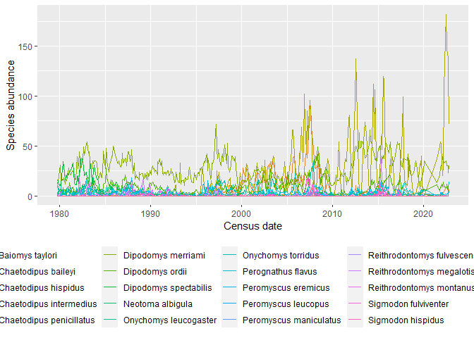

# Mouse report
Renata Diaz

<details>
<summary>Code</summary>

``` r
#| message: false
#| warning: false

library(dplyr)
```

</details>

    Warning: package 'dplyr' was built under R version 4.3.2


    Attaching package: 'dplyr'

    The following objects are masked from 'package:stats':

        filter, lag

    The following objects are masked from 'package:base':

        intersect, setdiff, setequal, union

<details>
<summary>Code</summary>

``` r
library(ggplot2)
```

</details>

# Data access

These data come from the [Portal Project](https://portal.weecology.org)
(Ernest et al. 2020)

<details>
<summary>Code</summary>

``` r
download.file("https://raw.githubusercontent.com/cct-datascience/CALS-workshops/2023-quarto-reports/20231206-quarto-reports/portal_mouse_data.csv", destfile = "mouse_data.csv")
download.file("https://raw.githubusercontent.com/cct-datascience/CALS-workshops/2023-quarto-reports/20231206-quarto-reports/portal_ref.bib", destfile = "portal_ref.bib")
```

</details>
<details>
<summary>Code</summary>

``` r
mouse_data <- read.csv("mouse_data.csv") |>
  mutate(censusdate = as.Date(censusdate))
```

</details>

# Mouse abundance over time

<details>
<summary>Code</summary>

``` r
ggplot(mouse_data, aes(censusdate, abundance, color = scientificname)) +
  geom_line() +
  theme(legend.position = "bottom") +
  xlab("Census date") +
  ylab("Species abundance")
```

</details>



# The most mice, ever

<details>
<summary>Code</summary>

``` r
mouse_data_ranked <- mouse_data |>
  group_by(scientificname) |>
  summarize(totalabundance = sum(abundance)) |>
  ungroup() |>
  arrange(desc(totalabundance))

knitr::kable(head(mouse_data_ranked))
```

</details>

<div id="tbl-abundances">

| scientificname           | totalabundance |
|:-------------------------|---------------:|
| Dipodomys merriami       |          12249 |
| Chaetodipus penicillatus |           7591 |
| Dipodomys ordii          |           3903 |
| Chaetodipus baileyi      |           2687 |
| Onychomys torridus       |           1926 |
| Dipodomys spectabilis    |           1626 |

Table 1: The most highly abundant species throughout the timeseries.

</div>

# A famous face


Merriam’s kangaroo rat ([Figure 2](#fig-merriams)) is the most highly
abundant species over time ([Table 1](#tbl-abundances)).

<div class="refs">

</div>

<div id="refs" class="references csl-bib-body hanging-indent">

<div id="ref-ernest2020" class="csl-entry">

Ernest, S. K. Morgan, Glenda M. Yenni, Ginger Allington, Ellen K.
Bledsoe, Erica M. Christensen, Renata M. Diaz, Keith Geluso, et al.
2020. “The Portal Project: A Long-Term Study of a Chihuahuan Desert
Ecosystem.” bioRxiv. <https://doi.org/10.1101/332783>.

</div>

</div>
